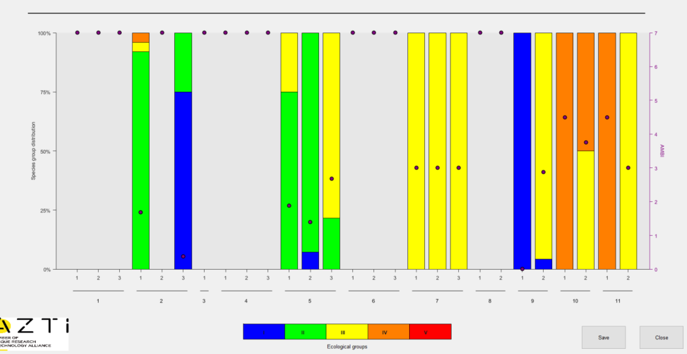

```{r, include = FALSE}
knitr::opts_chunk$set(
  collapse = TRUE,
  comment = "#>"
)
```

Create figures to illustrate AMBI results, in a similar style to those generated by the original AMBI software.

The original AMBI software allows the user to produce several types of figures illustrating the results of *AMBI* and *M-AMBI* index calculations. With the [ggplot2](https://ggplot2.tidyverse.org/) package, it is possible to create very similar, if not identical, figures. There is no reason to include additional functionality in the ambiR package which duplicates tasks that can be carried out using existing functionality in ggplot2 and which the experienced user will likely want to modify to their own preferences.

Having made the claim that figures from the AMBI software can be reproduced using ggplot2, it might be useful to include an example to illustrate how this can be done.

## Bar chart from original AMBI software

One type of figure that the AMBI software generates is a stacked bar chart showing composition of the samples belonging to groups I, II, III, IV and V for each station/replicate. The fractional composition (0-100%) is read from the primary (left) y-axis. Overlaying the bar chart are points indicating the resulting AMBI score (0-6) which is read from a secondary y-axis.

{width="80%" height="80%"}

## Bar chart using ggplot 

Using the test data set included with the package, we generate some AMBI index results to be plotted.

```{r setup}
library(ambiR)
library(dplyr)
library(tidyr)
library(ggplot2)

res <- AMBI(test_data, by=c("station"), var_rep = "replicate")
```

We first take the dataframe with results for replicates `AMBI_rep`. This includes 5 columns with fractions of the total number of individuals belonging to each group. We transpose this to long format. Then we convert the group variable to a factor so that the groups are arranged in the order we want, rather than in alphabetical order.

```{r transpose}
df <- res$AMBI_rep

df_group_freq <- df %>%
  pivot_longer(cols=c("I","II","III","IV","V"),
               names_to = "EcoGroup",
               values_to = "f")

df_group_freq$EcoGroup <- factor(df_group_freq$EcoGroup, 
                           levels = c("V","IV","III","II","I"))
```

Plotting the stacked bars is relatively straightforward. We also need to add the points indicating the resulting AMBI score (0-6) on a secondary y-axis. As 
described in `ggplot2::sec_axis()`, a secondary axis is *not* specified using absolute values but by specifying a transformation from the values in the primary axis. In our case, the primary axis is scaled from 0.0 to 1.0 (0% to 100%) and we want the secondary y-axis to be scaled from 0 to 6. This is achieved by multiplying by 6 (`transform =~.*6`). After this, our secondary y-axis is scaled from 0 to 6. Any variables to be plotted on this axis will undergo the same transformation, so they must be rescaled to the primary scale (0-1) before plotting. So in `geom_point` we specify `y=(AMBI/6)`.

We can now create this first version of the figure which includes all required features but uses only default formatting.

```{r plot1, fig.height=4, fig.width=7, fig.alt="Bar chart with default ggplot2 formatting"}
p <- ggplot() +
  geom_bar(data=df_group_freq, 
       aes(x=replicate, y=f, fill=EcoGroup),
       position = "fill", stat="identity", width=0.4) +
  geom_point(data=df, aes(x=replicate, y=(AMBI/6))) +
  scale_y_continuous(
    limits = c(0,1), 
    name= "Species group distribution",
    expand = c(0,0), 
    breaks = seq(0,1,0.25),
    labels = scales::label_percent(),
    sec.axis = sec_axis( transform =~.*6, name="AMBI")) +
  facet_grid(.~station, switch="x", scales="free_x",space="free")
 
p
```


## Bar chart with AMBI theme

By applying the correct fill colours to the bars and using `ggplot2::theme()`, 
we can modify the figure to give it a similar feel to the figures produced by 
the original AMBI software.

```{r plot2, fig.height=4, fig.width=7, fig.alt="Bar chart with AMBI theme"}
p <- ggplot() +
  geom_bar(data=df_group_freq,
           aes(x=replicate, y=f, fill=EcoGroup), 
           colour=alpha("grey20",1), position = "fill", stat="identity", 
           width=0.6, linewidth = 0.1, alpha=0.6) +
  geom_point(data=df, aes(x=replicate, y=(AMBI/6))) +
  scale_fill_manual(values=c("#ff0000","#ff8000","#ffff00","#00ff00","#0000ff"),
                    name="Ecological Group") +
  facet_grid(.~station, switch="x", scales="free_x",space="free") +
  scale_y_continuous(
    limits = c(0,1),
    name= "Species group distribution",
    expand = c(0,0),
    breaks = seq(0,1,0.25),
    labels = scales::label_percent(),
    sec.axis = sec_axis( transform =~.*6, name="AMBI")) +
  theme(text = element_text(size=9),
        strip.text.x.bottom = element_text(colour="grey20"),
        strip.placement = "outside",
        strip.background = element_blank(),
        panel.spacing.x = unit(0.5, units="cm"),
        panel.border = element_blank(),
        panel.background = element_blank(),
        panel.grid.major.x = element_blank(),
        panel.grid.minor.x = element_blank(),
        panel.grid.major.y =  element_blank(),
        panel.grid.minor.y = element_blank(),
        axis.line.x = element_line(colour="grey20", linewidth = 0.2),
        axis.line.y = element_line(colour="grey20", linewidth = 0.2),
        axis.title.x = element_blank(),
        axis.text.x.bottom = element_text(size=8),
        plot.background = element_blank(),
        legend.position = "bottom") +
  guides(fill = guide_legend(reverse=T))
p
```

There are still some small differences compared with the original. For example: 

* colour transparency - the `alpha=0.6` argument in `ggplot2::geom_bar()` causes
the bar colours to be slightly transparent. This is deliberate. To have solid 
colours, remove this argument.  

* legend text - the names of the Ecological Groups appear over their respective
colour keys in the original figure. Here they appear next to them. Challenge:
can you reproduce the original style of legend keys?

Starting with this example, only a few modifications are needed to replicate 
other variations of AMBI figures. For example, showing subsets of stations and 
replicates or for creating figures showing station results without replicates.
